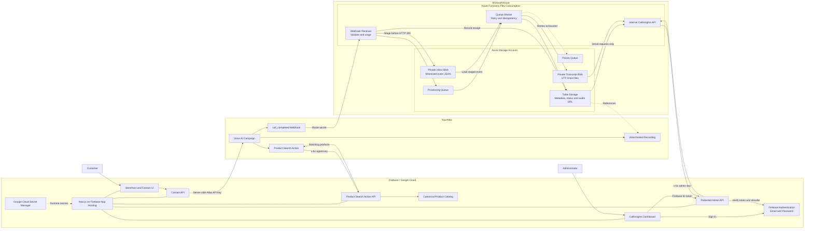
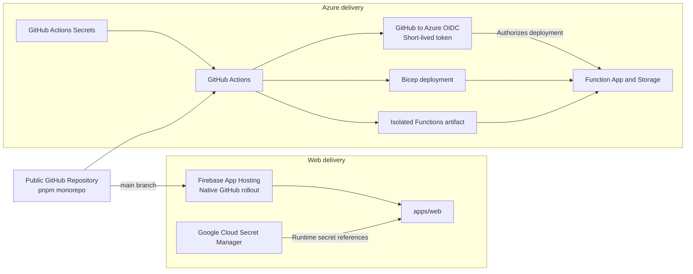

# Architecture

This directory describes the current BC-Shop architecture and the decisions
that shaped it.

## Runtime architecture

BC-Shop uses Firebase App Hosting for the dynamic Next.js application and
Firebase Authentication. Azure Functions and Azure Storage provide durable,
retryable processing for YourAtlas call-completion events. Atlas continues to
host call recordings; BC-Shop stores a validated audio reference and persists
the transcript as private Blob content.

## Delivery and secret management

The public repository contains source code and non-sensitive configuration only.
Firebase runtime secrets are resolved from Google Cloud Secret Manager. Azure
deployments use GitHub OIDC instead of client secrets or publish profiles, and
sensitive workflow values remain in GitHub Actions Secrets.

## Architecture decision records

| ADR                                                           | Decision                                                                                      |
| ------------------------------------------------------------- | --------------------------------------------------------------------------------------------- |
| [0001](decisions/0001-hybrid-firebase-azure-hosting.md)       | Host the web application on Firebase and event processing on Azure Functions Flex Consumption |
| [0002](decisions/0002-firebase-admin-authentication.md)       | Use Firebase Email/Password authentication with server-side authorization                     |
| [0003](decisions/0003-durable-atlas-webhook-ingestion.md)     | Decouple Atlas webhook receipt from processing with durable Storage Queue ingestion           |
| [0004](decisions/0004-azure-storage-persistence.md)           | Use Azure Blob Storage and Table Storage for call data in the initial architecture            |
| [0005](decisions/0005-atlas-integration-boundaries.md)        | Keep Atlas credentials and machine endpoints behind trusted server boundaries                 |
| [0006](decisions/0006-monorepo-independent-deployments.md)    | Keep one monorepo with independently deployable web and Functions workloads                   |
| [0007](decisions/0007-public-repository-secret-management.md) | Keep deployment identity and runtime secrets outside the public repository                    |

Detailed runtime behavior is documented in
[Atlas call-completed ingestion](atlas-call-ingestion.md).
